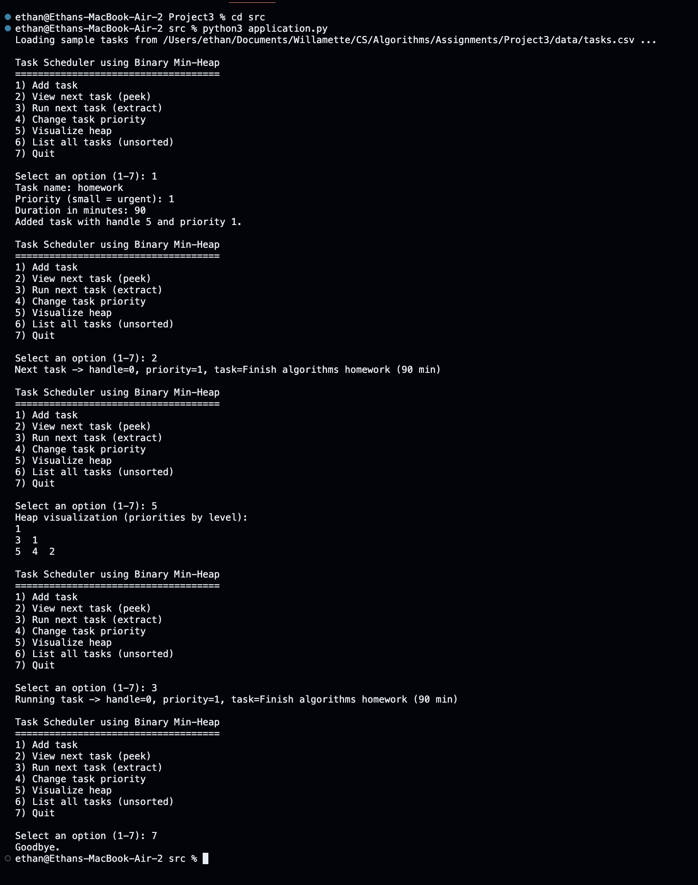
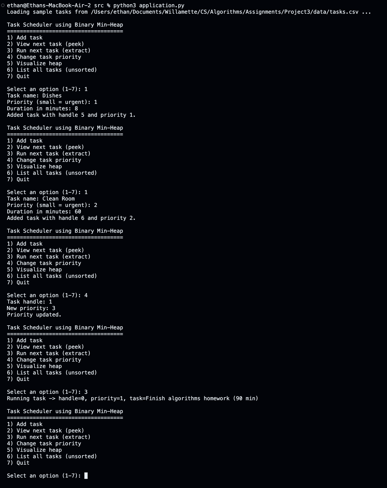
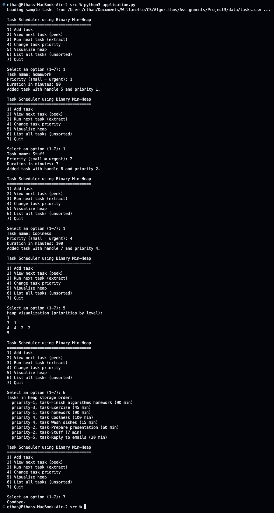

# Mini-Project 3: Tree Applications 🪾

## Project Overview

This project implements a binary min-heap in Python and uses it to build a small task scheduler. The scheduler keeps track of tasks with integer priorities. Lower numbers mean higher urgency, so the scheduler always runs the most urgent task first.

### What tree did you implement?

I implemented a binary min-heap. The heap stores (priority, payload) pairs and supports:

- insert
- extract_min
- peek_min
- change_priority
- merge
- to_level_order 

### What does the application do?

The application is a command-line program that:

- Lets the user add tasks with a name, priority, and estimated duration.
- Lets the user peek at the next task without removing it.
- Lets the user run the next task.
- Lets the user change the priority of a task using its handle.
- Shows a simple visualization of the heap as levels of priorities.

### Who would use this and why?

Someone would use this application if they want:

- A small example of a priority queue.
- A starting point for building more advanced schedulers.

## Team Members

- Ethan Bucy

## Installation and Setup
### Prerequisites

- Run python3

### How to run the application
From a terminal:
cd src
python3 application.py

## Usage Guide

When you run python3 application.py, you will see a menu:

1. Add task
2. View next task (peek)
3. Run next task (extract)
4. Change task priority
5. Visualize heap
6. List all tasks (unsorted)
7. Quit

### Screenshots

### Example workflow

1. Start the program:

  cd src
  python3 application.py
  
2. Option 1 – Add a few tasks:

  Name: Finish algorithms homework, Priority: 1, Duration: 90
  Name: Wash dishes, Priority: 4, Duration: 15
  Name: Exercise, Priority: 3, Duration: 45

3. Option 2 – View the next task. You should see the task with priority 1.

4. Option 5 – Visualize the heap to see priorities arranged by level.

5. Option 3 – Run the next task. The heap will remove the minimum and rebalance.

6. Option 7 – Quit the program when you are done.

### Expected input and output

Inputs: menu selections (1–7), task names, priorities, durations, and task handles for changing priority.
Outputs: Describing what task will run next, what was run, and how the heap currently looks.

The program guards against invalid integers and missing tasks, so it should fail gracefully on typical user mistakes rather than crash.

## Tree Implementation Details

The BinaryMinHeap class is defined in src/tree.py. It stores:

A list of HeapNode objects, each with priority, id, and payload.
A dictionary from id to index in the list, so that change_priority can find nodes in O(1) time.

### Complexity

- insert: O(log n) time, O(1) extra space
- extract_min: O(log n) time, O(1) extra space
- peek_min: O(1) time, O(1) extra space
- change_priority: O(log n) time, O(1) extra space
- merge: O(m log(n + m)) time, O(1) extra space (besides the new items)
- to_level_order: O(n) time, O(n) space to build the list

These time bounds show why the heap is better than a simple list. With a plain unsorted list, extract_min would cost O(n) because we must scan the whole list. With the heap, both insert and extract_min stay at O(log n).

## Evolution of the Interface

Initial design:

insert
extract_min
peek_min
is_empty
__len__

During implementation, I added:

change_priority(handle, new_priority)
merge(other)
to_level_order()

## Challenges and Solutions

Challenge 1 – Efficient change of priority.
A naive change_priority would scan the list to find the item, which would be O(n). To avoid this, the heap keeps a dictionary from node id to its index in the list. This lets the method find a node in constant time and then run the usual O(log n) bubble-up or bubble-down procedure.

Challenge 2 – File organization and relative paths.
Because the code lives under src/, the CLI needs to discover the project root before loading data files. The program uses Path(__file__).resolve() and parent.parent to compute the root directory, and then reads data/tasks.csv from there.

## Future Enhancements

If I had more time, I would:
Write more unit tests under tests/.
Add support for saving and loading the current heap to disk between runs.
Extend the visualization to draw an actual tree diagram instead of just printing levels.